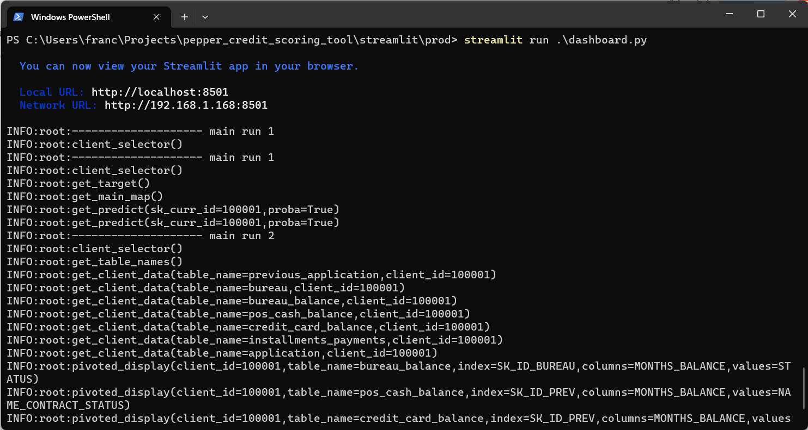
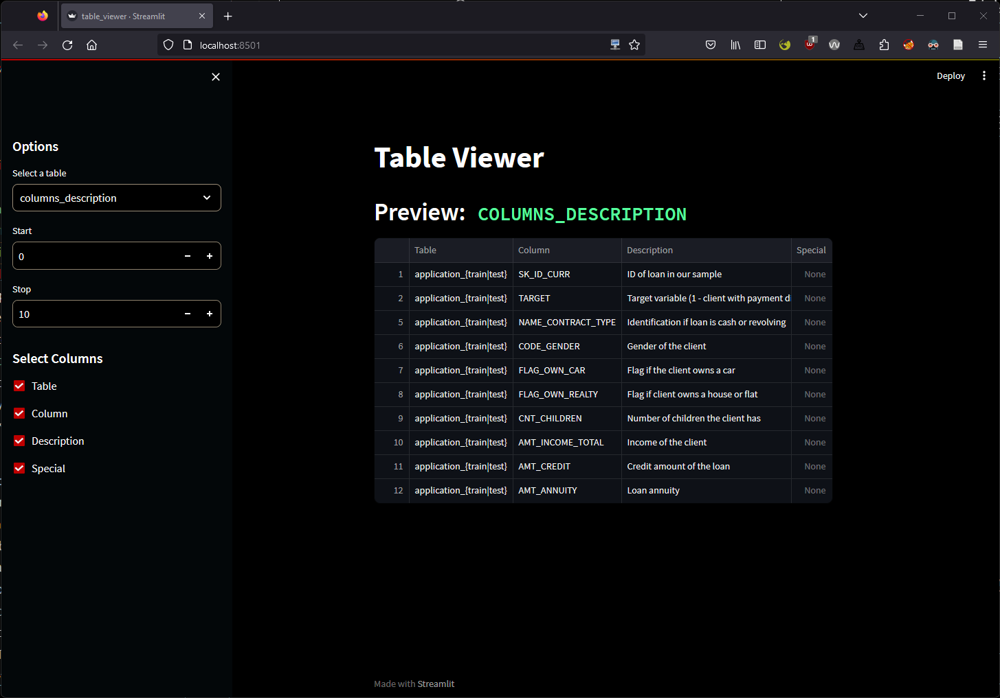
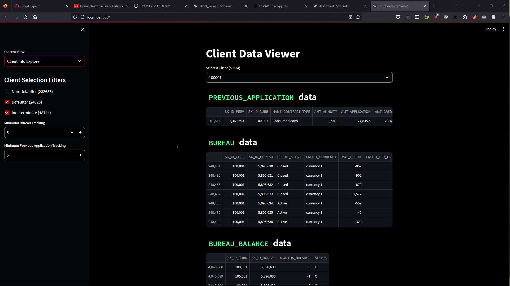
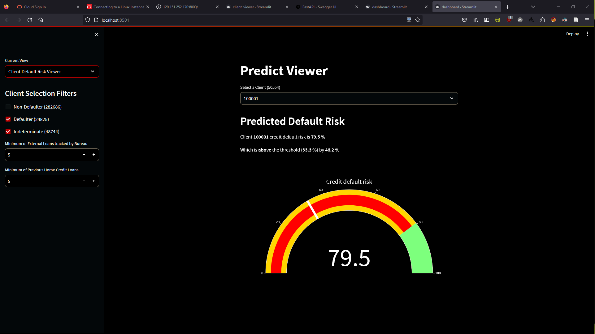

# Fichiers de dashboard Streamlit

## Note à propos du processus de développement

**Note** Ces sous-dossiers ne font pas partie du livrable OC, qui ne contient que les fichiers de l'application déployée en production.

Il nous a cependant semblé pertinent de décrire la démarche de production mise en oeuvre, avec cette structure de dossiers pour support.

- **`protos/`** : prototypes fonctionnels qui ciblent chacun une fonctionnalité spécifique.
    - **`protos/direct/`** : les prototypes en local sans passage par l'API, donc avec chargement local des modules et des données.
    - **`protos/via_api/`** : les mêmes prototypes (même structure de dossiers et fichiers, mêmes fonctions), mais avec récupération des données via l'API de serving.
- **`prod/`** : l'application intégrée basée sur **`protos/via_api/`** prêt à être déployée sur le serveur d'application (dashboard).

Les éléments du dossier **`prod/`** ont été d'abord dans le dossier **`protos/via_api/`** et sont déplacés vers la production lorsqu'ils ont été suffisamment testés et validés. Il n'y résident donc pas en doublon (sauf à démarrer une nouvelle version). En revanche, le fichier éponyme de **`protos/direct/`** est conservé, ce qui fait que **`protos/direct/`** contient davantage de fichiers que **`protos/via_api/`**.

Les version majeures des prototypes sont conservées avec une numérotation de version inverse : le fichier sans suffixe est le fichier actuel, la version précédente est suffixée avec `_1`, la précédente avec `_2` et ainsi de suite, le numéro de version indiquant donc l'ancienneté.

## Dépendances

L'application Streamlit utilise les librairies suivantes :
- **`typing`** pour le _typehinting_ des signatures des fonctions.
- **`os`**, **`sys`**, **`dotenv`** pour le chargement de variables d'environnement à partir d'un `.env` et la mise à jour du `PYTHONPATH` pour lier avec des modules situés dans des dossiers distants. Cette fonctionnalité n'est utilisée que pour le développement, mais n'a plus d'utilité en production.
- **`logging`** pour la production de traces d'exécution du serveur et l'alimentation de journaux.
- **`inspect`** est utilisé pour réaliser la fonction `this_f_name`, indispensable pour le côté _user friendly_ de notre framework de développement d'application basé sur Streamlit et Fast API.
- **`json`** pour certains traitement des données sérialisées en JSON et transmises via HTTP.
- **`requests`** pour le dialogue HTTP/JSON entre l'application et le serveur d'API.
- **`pandas`** et **`numpy`** pour les manipulations de données résiduelles à effectuer sur le front-end, - **`streamlit`** comme framework d'application qui fournit diverses facilités pour le caching des données et un cadre d'assemblage d'application interactive, avec divers contrôles et divers _widgets_, et notamment l'intégration des des librairies de tracé les plus populaires, comme `matplotlib` ou `plotly`.

## Composants de l'application

Les composants techniques :
- **`_dashboard_commons`** : instructions d'initialisation comme par exemple le niveau des traces de journalisation et quelques fonctions utilitaires partagées entre les routers. Chaque page de l'application, y compris la page principale, importe l'intégralité de ce module commun.
- **`_api_getters_`** : la passerelle vers Fast API, constituée des fonctions d'accès aux données produites par les différentes routes. La complexité de la communication HTTP, du décodage JSON et du chargement des données dans les formats attendus sont masquées, ce qui permet au code applicatif de ses concentrer sur l'applicatif, c'est-à-dire les fonctionnalités utilisateur.

Les composants applicatifs :
- **`client_viewer.py`** : visualisation de l'ensemble des information d'un client.
- **`client_default_risk.py`** : visualisation à l'aide d'une jauge colorée de la prédiction du modèle quant au risque de défaut d'un client.
- **`table_viewer.py`** : explorateur de tables.
- **`dashboard.py`** : l'application principale qui intègre chacun des composants précédent dans le cadre d'une même session d'utilisation.

# Lancement et check du serveur d'API

## Lancement et exécution en local

Si la version **`protos/via_api/`** ou **`prod/`**, avoir préalablement lancé le serveur d'API.

Depuis un second terminal, se placer dans le dossier **`{project_dir}/streamlit/`**

```sh
streamlit run ./table_viewer.py
```

Vérifier que tout fonctionne bien :

Se rendre sur http://localhost:8501. L'écran suivant devrait s'afficher :


Traces d'exécution (journalisation) de l'application Streamlit :




Pour un lancement de Streamlit directement depuis l'URL GitHub de l'application :

```sh
streamlit run https://raw.githubusercontent.com/Franck-PepperLabs/pepper_credit_scoring_tool/main/streamlit/prod/dashboard.py
```

# Fonctionnalités de l'application


## Exploration des tables Home Credit



## Visualisation des informations d'un client

L'information est prélevée sur l'ensemble des tables.



## Visualisation de l'estimation du risque de défaut d'un client



